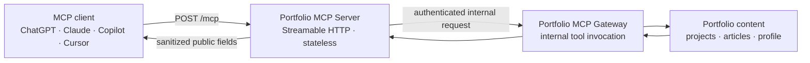

# Portfolio MCP Server

A public, read-only [Model Context Protocol (MCP)](https://modelcontextprotocol.io/) server for [Yuqi Guo's portfolio](https://www.yuqi.site). It lets MCP-compatible clients search projects and technical articles, inspect stored project architecture, and retrieve Yuqi's public professional profile.

The server exposes a stateless Streamable HTTP endpoint designed for clients such as ChatGPT, Claude, GitHub Copilot, and Cursor. It delegates content lookups to the portfolio platform's internal MCP gateway and sanitizes every response before returning it to the client.

## How it works



## Tools

| Tool | Description | Inputs |
| --- | --- | --- |
| `search_projects` | Search projects by technology, architecture pattern, or keyword | `keyword`, optional `category` and `limit` |
| `get_project` | Retrieve the details and links for a project | `projectId` |
| `get_project_architecture` | Return pre-authored Mermaid diagrams stored with a project | `projectId` |
| `search_articles` | Search published technical articles and blog posts | `keyword`, optional `category` and `limit` |
| `get_article` | Retrieve a published article by ID | `articleId` |
| `get_profile` | Retrieve Yuqi's public experience, skills, education, and CV link | None |

All tools are read-only and non-destructive. Search results are limited to 20 items. Responses omit internal IDs, audit data, indexing state, raw HTML, and other private implementation fields; long content is truncated to a configurable maximum.

## Run locally

### Prerequisites

- Node.js 20 or newer
- npm
- Access to the portfolio MCP gateway and its internal token

Clone and install the server:

```sh
git clone https://github.com/YuqiGuo105/portfolio-mcp-server.git
cd portfolio-mcp-server
npm ci
```

Set the required gateway configuration:

```sh
export MCP_GATEWAY_URL="https://your-gateway.example.com"
export MCP_GATEWAY_INTERNAL_TOKEN="your-shared-secret"
```

Start the server:

```sh
npm start
```

The MCP endpoint is available at `http://localhost:8080/mcp`; the health endpoint is available at `http://localhost:8080/health`.

For development with automatic restarts:

```sh
npm run dev
```

## Configuration

| Variable | Required | Default | Description |
| --- | --- | --- | --- |
| `MCP_GATEWAY_INTERNAL_TOKEN` | Yes | Empty | Bearer token used to authenticate with the internal gateway |
| `MCP_GATEWAY_URL` | No | Deployed portfolio gateway | Base URL of the internal MCP gateway |
| `PORT` | No | `8080` | HTTP listening port |
| `GATEWAY_TIMEOUT_MS` | No | `10000` | Gateway request timeout in milliseconds |
| `SITE_URL` | No | `https://www.yuqi.site` | Base URL used to build canonical content links |
| `MAX_CONTENT_LENGTH` | No | `8000` | Maximum returned article or project body length |

Do not expose `MCP_GATEWAY_INTERNAL_TOKEN` in client configuration or commit it to source control. MCP clients connect only to this server's public `/mcp` endpoint.

## Connect an MCP client

Configure your client with the deployed Streamable HTTP URL:

```txt
https://your-mcp-server.example.com/mcp
```

The exact configuration format varies by client. Choose **Streamable HTTP** as the transport when the client asks for a transport type.

## Docker

Build and run the included production image:

```sh
docker build -t portfolio-mcp-server .
docker run --rm -p 8080:8080 \
  -e MCP_GATEWAY_URL="https://your-gateway.example.com" \
  -e MCP_GATEWAY_INTERNAL_TOKEN="your-shared-secret" \
  portfolio-mcp-server
```

Verify the service:

```sh
curl http://localhost:8080/health
```

## Related project

- [YuqiGuo105/Portfolio](https://github.com/YuqiGuo105/Portfolio) — the Next.js portfolio frontend and platform overview

## License

No license file is currently included. All rights are reserved unless a license is added.
