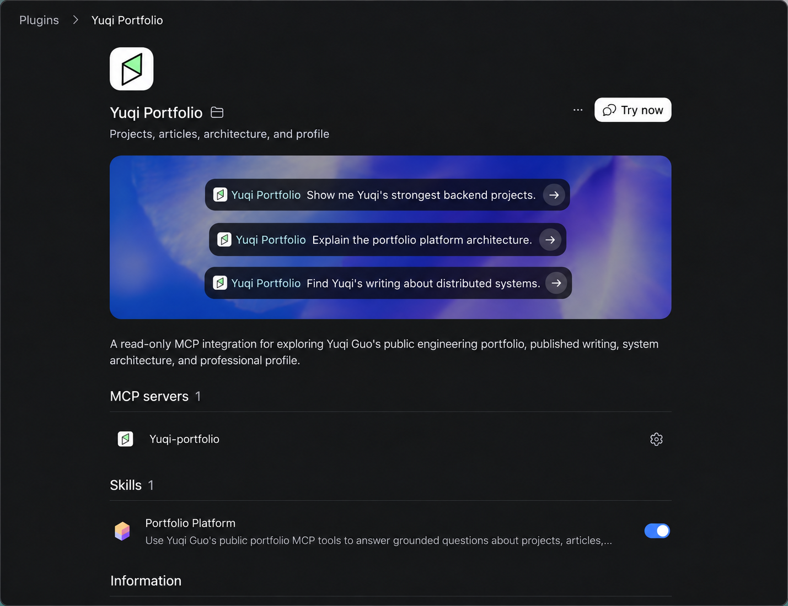
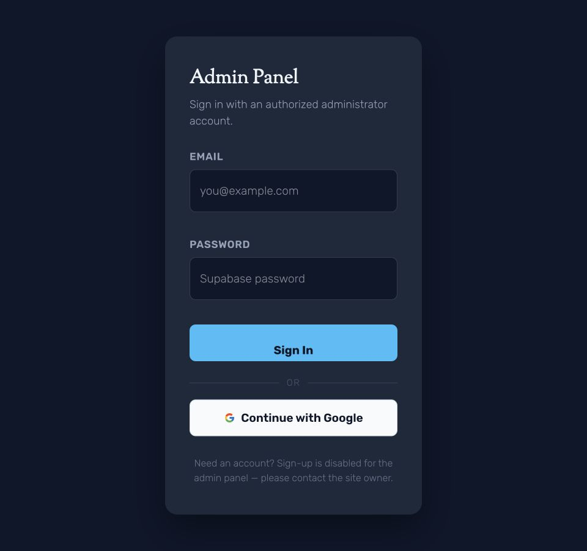

  

<h1 align="center">Portfolio MCP Gateway</h1>

  <strong>Connect AI assistants to real knowledge and controlled actions.</strong>

  Built by <strong>Yuqi Guo</strong>. Used with Claude and Codex. 
  Public answers with sources. Protected tools for platform administration.

  <a href="https://www.yuqi.site/mcp-guide"><strong>Connect a Client</strong></a> &middot;
  <a href="#public-edition">Public Edition</a> &middot;
  <a href="#administrator-edition">Administrator Edition</a> &middot;
  <a href="#architecture">Architecture</a>

## What I Built

A **Model Context Protocol (MCP) gateway** that lets AI assistants search portfolio
knowledge and help authorized administrators operate the platform.

- **Grounded answers:** projects, articles, and professional background with source links.
- **Controlled access:** validated requests, role-based permissions, and required approvals for protected writes.
- **Recoverable workflows:** tracked outcomes, duplicate-request protection, and audit records across backend services.

**Stack:** Node.js &middot; MCP SDK &middot; Zod &middot; OAuth/JWT &middot; Java/Spring

## Public Edition

**Explore the portfolio from an AI conversation. No portfolio login required.**

Ask: *"Which project demonstrates Yuqi's distributed-systems experience?"*

  

Codex: discover projects, writing, and professional background.

  

Claude: read-only tools. No private records or administrator actions.

**Endpoint:** `https://www.yuqi.site/mcp`

## Administrator Edition

**An authorized administrator account and OAuth consent are required.**
Signing in alone does not grant admin access.

Connect &rarr; sign in &rarr; approve access &rarr; use permitted tools.

  

Sign in with an existing authorized account. Public registration is disabled.

  

After authorization: role-controlled tools with required write approvals.

| Investigate | Manage |
| --- | --- |
| Visitor activity and alert delivery | Content and knowledge records |
| Chat questions, final answers, and execution events | Publishing, indexing, and supported recovery |
| Service health, costs, and operation history | Alert rules and permitted budget settings |

**Endpoint:** `https://www.yuqi.site/mcp/admin`

## Architecture

The **Node.js edge** handles client connections and validated tool requests.
The **Java gateway and domain services** enforce policy, track operations, and own business data.

  

<a href="docs/architecture/public-mcp-edge.svg"><strong>View full-size architecture</strong></a>

**Reliability:** stable idempotency keys, persisted outcomes, bounded retries,
and explicit recovery for uncertain writes. A timeout is not treated as permission
to repeat an action.

## Technical Details

[Client setup](docs/CLIENT_INTEGRATIONS.md) &middot;
[Admin workspace](docs/ADMIN_WORKSPACE.md) &middot;
[Recovery design](docs/DURABLE_OPERATIONS.md) &middot;
[Connection diagnostics](docs/CONNECTION_DIAGNOSTICS.md) &middot;
[Run and test locally](docs/DEVELOPMENT.md)

[Edge source](src/index.js) &middot;
[Tool registry](src/tool-registry.js) &middot;
[Backend platform](https://github.com/YuqiGuo105/portfolio-ai-platform)

Real product screenshots; tool counts and client support vary by release.
[Image provenance](docs/screenshots/README.md).
This repository has no license file; the separate portfolio's MIT license does not apply automatically.
