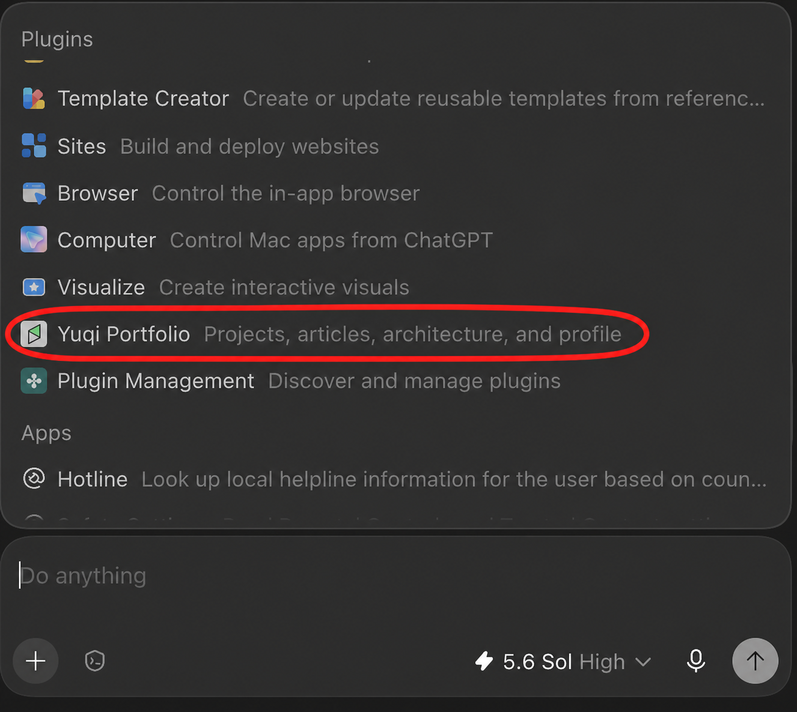
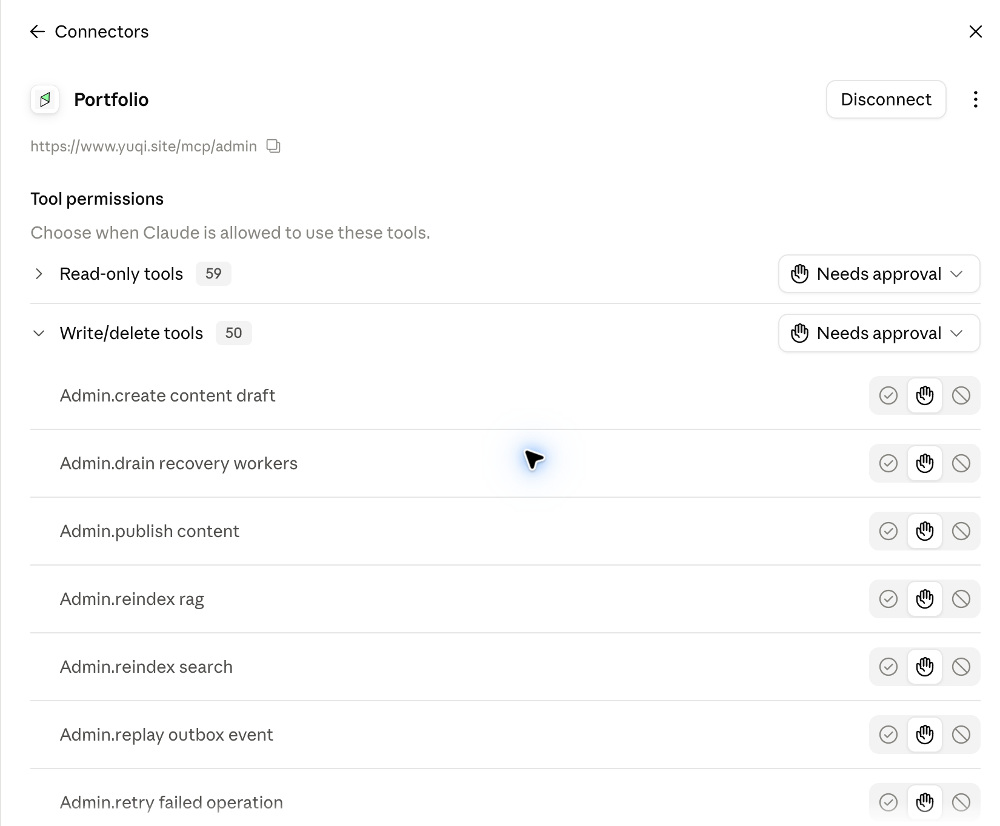

<p align="center">
  
</p>
<h1 align="center">Portfolio MCP Gateway</h1>
<p align="center">
  <strong>Public knowledge. Protected operations. Traceable execution.</strong><br />
  An MCP access layer for Yuqi Guo's multi-service portfolio platform.
</p>
<p align="center">
  <a href="https://www.yuqi.site/mcp-guide">Connection Guide</a> &middot;
  <a href="#public-edition">Public Edition</a> &middot;
  <a href="#administrator-edition">Administrator Edition</a> &middot;
  <a href="#architecture">Architecture</a> &middot;
  <a href="#development">Development</a>
</p>

Connect an AI client to published portfolio knowledge, or authorize it to operate
the platform through **schema-validated tools, managed RBAC, confirmation-gated
writes, durable operation tracking, and structured audit records**.

This repository implements the **Node.js MCP edge and client integration**. The
[internal Java gateway](https://github.com/YuqiGuo105/portfolio-ai-platform) and
owning backend services enforce domain policy and persist operational state.
The edge is stateless; conversation persistence belongs to the AI Agent platform,
not an in-memory MCP connection.

## Two Separate Access Boundaries

| | Public edition | Administrator edition |
| --- | --- | --- |
| Endpoint | `https://www.yuqi.site/mcp` | `https://www.yuqi.site/mcp/admin` |
| Sign-in | No portfolio account required | **Sign-in and an authorized managed role required** |
| Purpose | Discover projects, writing, architecture, and profile evidence | Inspect and manage platform data and operations |
| Data | Published content and approved public evidence | Records permitted by the authenticated role and tool |
| Writes | Not available | Tool-specific confirmation, validation, and stable idempotency keys |
| Discovery | Curated read-only tools | Backend catalog filtered for the current principal |
| Private diagnostics | Not available | ADMIN-only agent diagnostics and visual workspace |

Signing in to the website does not upgrade a public connector. Administrator
access requires a **separate connection**. Client approval preferences do not
replace server-side authorization.

## Public Edition

### Connect and ask

Add `https://www.yuqi.site/mcp` as a remote Streamable HTTP MCP server in a
compatible client. No portfolio credentials or internal gateway token are needed.

Try: **"Explain Yuqi's strongest backend project and link the supporting evidence."**

<p align="center">
  <a href="docs/screenshots/claude-public-connector.png">
    
  </a>
</p>
<p align="center"><sub>Public connector in Claude. This earlier capture shows a subset of today's tools; use live discovery for the current catalog.</sub></p>

### Available capabilities

| Capability | Protocol tools | Result |
| --- | --- | --- |
| Portfolio discovery | `search_portfolio`, `search_projects`, `get_project` | Ranked content, project details, and canonical links |
| Architecture | `get_project_architecture` | Stored diagrams and component descriptions, not invented architecture |
| Articles and travel posts | `search_articles`, `get_article` | Technical and life content, source type, and paginated article text |
| Profile and social links | `get_profile`, `get_social_profiles` | Approved evidence and owner-configured GitHub, LeetCode, and Instagram URLs |
| Knowledge retrieval | `search_knowledge` | Multilingual evidence from published content and approved public answers |
| Connection diagnostics | `connection.check` | Connection, tool-name, and argument-schema checks |

Search is bounded and responses are sanitized. Personal answer evidence must be
explicitly public, active, retrieval-enabled, and approved. Private resumes and
candidate memory are not exposed; restricted source links remain withheld.
Retrieval failures are errors, not empty profiles. A keyword miss does not prove
that a fact is false.

### Codex integration

```sh
codex mcp add yuqi-portfolio --url https://www.yuqi.site/mcp
codex mcp list
```

The [Codex plugin](plugins/yuqi-portfolio) also bundles the public server
configuration and grounding instructions, without admin tools or credentials.

<p align="center">
  <a href="plugins/yuqi-portfolio/assets/codex-plugin.png">
    
  </a>
</p>
<p align="center"><sub>The public Yuqi Portfolio plugin in Codex. Client appearance varies by version.</sub></p>

See [client setup](docs/CLIENT_INTEGRATIONS.md) for plugin installation and
configuration examples for Claude Code, Cursor, VS Code, and Gemini CLI.
Support depends on the MCP host, not just the model provider: CLI support does
not imply that a provider's consumer web chat accepts custom MCP servers.

## Administrator Edition

### Sign-in is mandatory

Create a **separate** connector with `https://www.yuqi.site/mcp/admin`. Complete
portfolio sign-in and OAuth consent with an authorized account, then refresh
tool discovery. OAuth establishes identity; the managed role determines which
tools can actually be listed and invoked.

<p align="center">
  <a href="docs/screenshots/claude-admin-connector.png">
    
  </a>
</p>
<p align="center"><sub>Administrator connector after authorization. Counts reflect the captured catalog and account permissions, not a fixed entitlement.</sub></p>

**Signing in alone does not grant administrator access.** Each admin MCP request
verifies the access token and resolves the managed role. Authorization-service
failures deny access; user-editable profile metadata cannot grant privileges.
Owner-account management adds an owner-only boundary.

### Operator workflows

| Area | Workflow | Boundary |
| --- | --- | --- |
| Content and knowledge | Find records, prepare edits, publish, and reindex Search/RAG | Catalog-defined role, validation, and write controls |
| Visitor intelligence | Inspect authorized event/session details and automation evidence | Private details never reach public clients; signals are not proof of human identity |
| Behavior alerts | Review a versioned rule change, then explicitly apply it | Expiry, revision checks, confirmation, and idempotent apply |
| Delivery and recovery | Inspect failures, delivery status, operation timelines, and supported retries | Verify uncertain outcomes before retrying or replaying |
| Chat Agent diagnostics | Inspect questions, final answers, sources, timings, and execution records | ADMIN-only; execution evidence, not hidden model reasoning |
| Candidate workflows | Access owner-managed application memory and resume capabilities | Private career-service policy; excluded from the public plugin |
| Access management | Inspect or change managed administrator access | Owner-only checks in the owning service |

The deployed backend catalog is authoritative. Use exact tool names returned by
your client's discovery, rather than constructing a `Portfolio:...` alias.

### Workspace and self-check

Ask **"Open the admin workspace"** to inspect visitor timelines, operations, and
knowledge records inside an MCP Apps-capable client. Retries require current-state
review and explicit confirmation. Text-only clients receive a summary and a link
to the protected admin console.

Ask **"Check this MCP connection and explain the results in Chinese"**, or call
`connection.check` with `{"locale":"zh"}`. It validates sample tool names and
arguments without executing operations. Public checks reveal no private tool
details. Pre-login diagnostics use the MCP service origin; a website proxy may
not forward that route.

- [Visual workspace: tools, security, and verification](docs/ADMIN_WORKSPACE.md)
- [Connection diagnostics: errors and recovery guidance](docs/CONNECTION_DIAGNOSTICS.md)
- [Administrator OAuth and agent diagnostics setup](docs/CLIENT_INTEGRATIONS.md#administrator-tools)

## Architecture

<p align="center">
  <a href="docs/architecture/public-mcp-edge.svg">
    
  </a>
</p>
<p align="center"><a href="docs/architecture/public-mcp-edge.svg">Open the full-size architecture diagram</a></p>

| Layer | Responsibility | Implementation |
| --- | --- | --- |
| MCP edge | Streamable HTTP, OAuth resource metadata, JWT verification, discovery, typed arguments, sanitization | [Server](src/index.js), [auth](src/admin-auth.js), [registry](src/tool-registry.js), [public tools](src/tools.js) |
| Internal gateway | Canonical catalog, policy enforcement, durable dispatch, downstream resilience | [AI platform](https://github.com/YuqiGuo105/portfolio-ai-platform), [edge adapter](src/gateway-client.js) |
| Domain services | Content, analytics, notifications, knowledge, candidate data, and domain transactions | [Admin](https://github.com/YuqiGuo105/portfolio-admin-service), [analytics](https://github.com/YuqiGuo105/portfolio-analytics-platform), [notifications](https://github.com/YuqiGuo105/portfolio-notification-service), [career](https://github.com/YuqiGuo105/portfolio-application-copilot) |
| State and evidence | Database-backed operation transitions, audit projection, and agent-owned conversation history | [Durable operations](docs/DURABLE_OPERATIONS.md), [event correlation](src/operation-events.js) |

**Public read:** discover a curated tool, validate arguments, retrieve approved
evidence, sanitize the result, and return canonical links.

**Protected write:** verify identity and permissions, validate the request, obtain
required confirmation, claim a durable operation with a stable key, dispatch to
the owning service, and expose status for follow-up.

## Reliability and Security

| Control | Behavior |
| --- | --- |
| Schema validation | Registered schemas validate arguments before dispatch |
| Managed RBAC | Discovery and invocation enforce roles; sensitive domains add owner or ADMIN checks |
| Confirmation | `confirmRequired` tools require explicit approval at the edge and internal gateway |
| Idempotency | Write retries reuse the same key and arguments; conflicting reuse is rejected |
| Durable status | Database-backed transitions survive restarts; completed operations can return stored results |
| Downstream resilience | Internal adapters use circuit breaking, bulkheads, and rate limits; no blind write retries |
| Audit boundaries | Correlated execution records support investigation without logging raw private arguments |
| Credential isolation | Backend secrets stay server-side, outside public plugin configuration |

Preserve one `_idempotencyKey` per write intent. Follow the returned state:

| State | Meaning | Next action |
| --- | --- | --- |
| `RUNNING` | A worker owns dispatch | Query operation status |
| `SUCCEEDED` | The tool result was persisted | Verify asynchronous indexing or delivery separately |
| `RETRYABLE` | Rejected before downstream dispatch | Respect backoff; retry the same intent and key |
| `FAILED_FINAL` | Downstream rejected the request | Inspect the error; corrected intent needs a new key |
| `UNKNOWN` | Completion is uncertain | Reconcile downstream state; do not blindly retry |
| `PREVIEW` | Dry-run validation only | Obtain approval before the real write |

These controls do **not** claim global exactly-once execution across services.
SMTP acceptance does not prove inbox delivery. See the
[recovery contract and boundaries](docs/DURABLE_OPERATIONS.md).
MCP annotations help clients present tools; they are not security enforcement.

## Development

Requires Node.js 20+ and npm. Meaningful tool calls also require access to the
internal gateway; this repository is not a standalone copy of all backend services.

```sh
git clone https://github.com/YuqiGuo105/portfolio-mcp-server.git
cd portfolio-mcp-server
npm ci
npm run build
npm run check
npm test
```

Supply `MCP_GATEWAY_URL` and `MCP_GATEWAY_INTERNAL_TOKEN` through your environment
or secret manager, then run `npm start`. The default port is `8080`; `/health` is
the health endpoint and `/mcp` is the public MCP route. Never commit real secrets.

<details>
<summary><strong>Runtime configuration</strong></summary>

| Variable | Purpose |
| --- | --- |
| `MCP_GATEWAY_URL` | Internal gateway origin; configure explicitly for your environment |
| `MCP_GATEWAY_INTERNAL_TOKEN` | Server-to-gateway credential; never distribute to clients |
| `PORT` | HTTP port, default `8080` |
| `SITE_URL` | Canonical origin, default `https://www.yuqi.site` |
| `GATEWAY_TIMEOUT_MS` | Default gateway deadline, `10000` ms |
| `CAREER_GATEWAY_TIMEOUT_MS` | Career gateway deadline, `30000` ms |
| `MAX_CONTENT_LENGTH` | Returned content bound, default `8000` |
| `SUPABASE_AUTH_ISSUER` | Admin JWT issuer and asymmetric JWKS discovery |
| `SUPABASE_JWT_SECRET` | Legacy HS256 verification, when that token format is used |
| `ADMIN_SERVICE_URL` | Managed authorization service for production |
| `ADMIN_ALLOWED_EMAILS` | Environment-only fallback without an admin service; not a substitute for production managed roles |
| `ADMIN_AUTH_TIMEOUT_MS` | Authorization deadline, `5000` ms |
| `TOOL_CATALOG_CACHE_TTL_MS` | Catalog refresh interval, `60000` ms |
| `TOOL_CATALOG_MAX_STALE_MS` | Bounded stale catalog fallback, `900000` ms |

</details>

<details>
<summary><strong>Browser tests and Docker</strong></summary>

```sh
npx playwright install chromium
npm run test:e2e
```

The E2E suite uses isolated services, real HTTP/MCP transport, and an MCP Apps
host. It does not prove every third-party client's UI or consent flow works.
Live verification is separate and requires deliberate administrator authorization.

```sh
docker build -t portfolio-mcp-server .
docker run --rm -p 8080:8080 \
  -e MCP_GATEWAY_URL -e MCP_GATEWAY_INTERNAL_TOKEN \
  portfolio-mcp-server
```

The Docker example forwards configured environment variables. Set up admin
authentication separately before enabling privileged connections.

</details>

## Documentation and Related Projects

- [Portfolio website and platform overview](https://github.com/YuqiGuo105/Portfolio)
- [Client configurations](docs/client-configs) and [integration guide](docs/CLIENT_INTEGRATIONS.md)
- [Durable operations](docs/DURABLE_OPERATIONS.md)
- [Admin workspace](docs/ADMIN_WORKSPACE.md) and [connection diagnostics](docs/CONNECTION_DIAGNOSTICS.md)
- [Screenshot provenance](docs/screenshots/README.md)

## License

This repository does not currently include a license file. Do not assume that
the main portfolio repository's MIT license applies to this separate repository.
